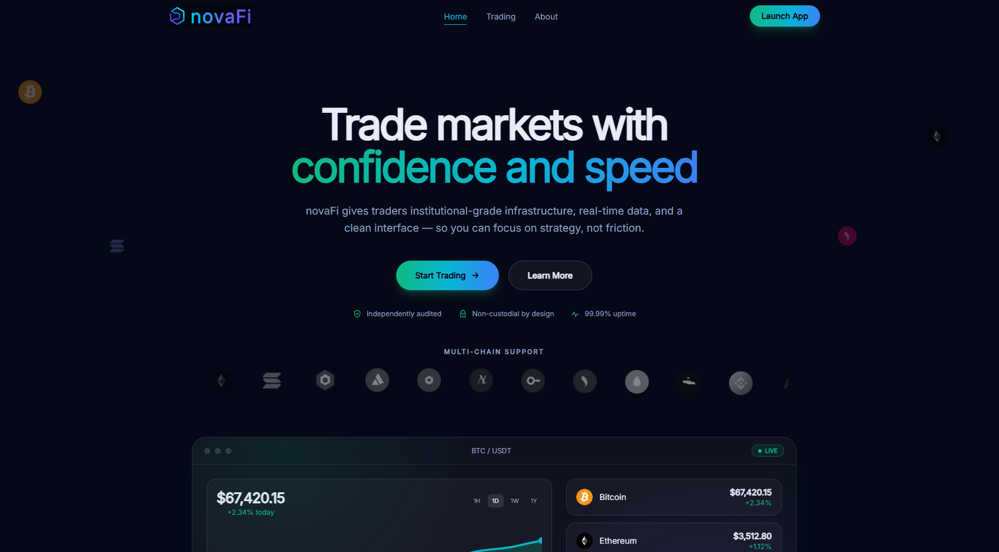

# NovaFi



NovaFi is a Web3-focused technology company developing decentralized applications that combine blockchain infrastructure with engaging user experiences.

Our current focus is building a next-generation non-custodial crypto trading platform powered by an Automated Market Maker (AMM) system. The main idea behind the platform is to allow users to trade and interact with digital assets in a decentralized environment without depending on traditional intermediaries such as brokers, banks, or centralized exchanges.

However, we are not trying to build just another decentralized exchange. Our vision is to create a more complete Web3 financial ecosystem by combining decentralized trading infrastructure with interactive experiences, prediction features, and gamified engagement mechanisms.

We believe the future of decentralized applications will not only be about transactions—it will be about creating ecosystems where users actively participate, interact, and build long-term relationships with the platform.

## Setup

Install dependencies:

```bash
npm i
```

Start the development server:

```bash
npm start
```

The app runs locally on [http://localhost:2588](http://localhost:2588).
